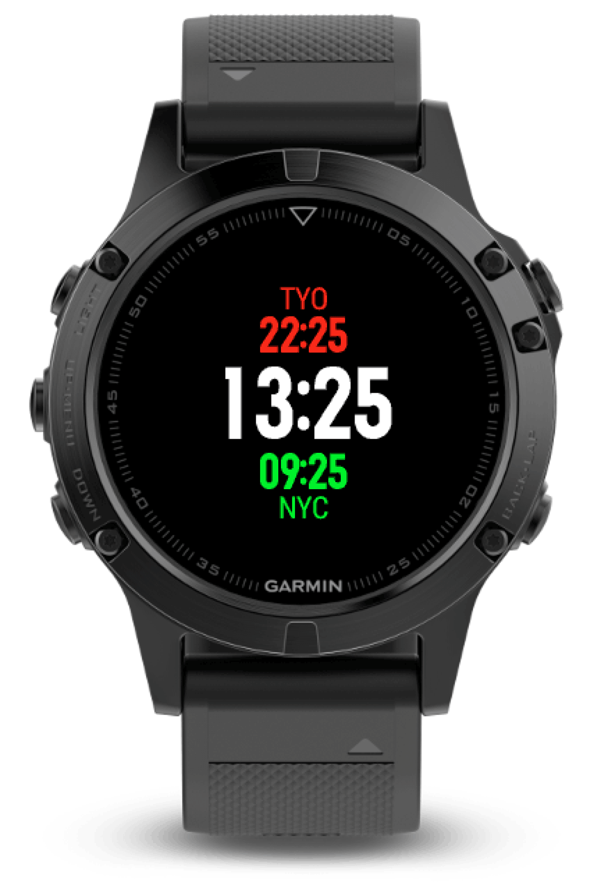

# Timezone Demo

A quick demo that showcases how to calculate timezones on CIQ.

## Features

- Data is based on the [IANA 2018e database](https://www.iana.org/time-zones).
- All timezones are DST adjusted until 2030.
- Along with UTC and Local time, the timezone offsets can be set to over 30 global cities.
- Supported cities include; Africa/Johannesburg, America/Anchorage, America/Los Angeles, America/Chicago, America/Denver, America/Mexico City, America/Santiago, America/Toronto, America/New York, America/Vancouver, Asia/Dubai, Asia/Istanbul, Asia/Seoul, Asia/Shanghai, Asia/Tokyo, Asia/Singapore, Asia/Manila, Atlantic/Azores, Australia/Perth, Australia/Sydney, Europe/Athens, Europe/Berlin, Europe/Helsinki, Europe/London, Europe/Moscow, Europe/Paris, Europe/Prague, Europe/Rome, Europe/Stockholm, Pacific/Auckland, Pacific/Honolulu
